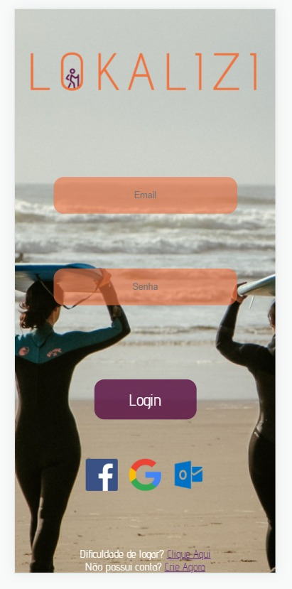
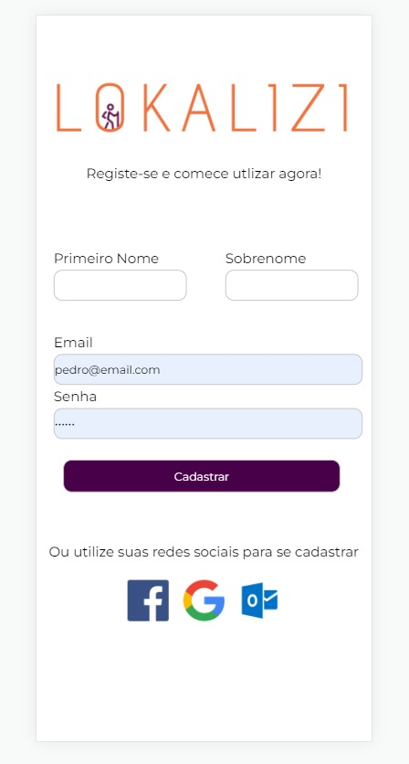

## Lokalizi - INFNET
Projeto realizado em grupo pelos estudantes:
* Anna Grateki (UI, UX - Desing)
* Thiago Segadães Pace (Scrum Master)
* Pedro Humberto Gonçalves Cardoso (Dev Full Stack)
* José Macedo (Dev Front-End)

Obs: Projeto foi feito para ser mobile, deve rodar com orientação mobile 400x850

<center>  </center>

---

## O Projeto:
“Sistema de Apoio ao Visitante em Grandes Eventos”

Durante grandes eventos, como a Copa do Mundo e os Jogos Olímpicos, uma grande quantidade de visitantes de outros países e de outros estados chegam à cidade para passar vários dias. Durante este tempo eles têm necessidade de encontrar restaurantes, bares, podem querer ir à praia, podem precisar registrar uma ocorrência policial ou ir a um hospital. Essas pessoas não conhecem a cidade, não sabem os nomes dos bairros, como se chega aos lugares nem o que está disponível em termos de serviços municipais e estaduais.

O objetivo do sistema que você vai começar a desenvolver é dar apoio a esta pessoa. Ele deve buscar informações dos seguintes repositórios (fictícios):

Hospitais
Delegacias
Pontos Turísticos
Praias
Onde Comer
Onde Dormir
Eventos
Banheiros

---
#### Check-List:

- [x] Cadastro de usuario
- [x] Autenticar Cadastro
- [x] Cadastrar com Faceboo, e Google
- [x] Posicionar botões
- [x] Importar Google Maps
- [x] Utilizar Vuex
- [ ] Funcionalidade de Geolocalização
- [ ] Google Places
- [ ] Preenchimento Automatico
- [ ] Alterar Fundo para escuro
- [ ] Criar banco de dados cloud Firebase
- [ ] Usuario pode adicionar favoritos

---


### Libraries

* Vuex
* Vue-Route
* Google-Maps
* @fawmi/vue-google-maps

### Back-End
* Firebase

---

## Imagens do projeto:




---


## Project setup
```
npm install
```

### Compiles and hot-reloads for development
```
npm run serve
```

### Compiles and minifies for production
```
npm run build
```

